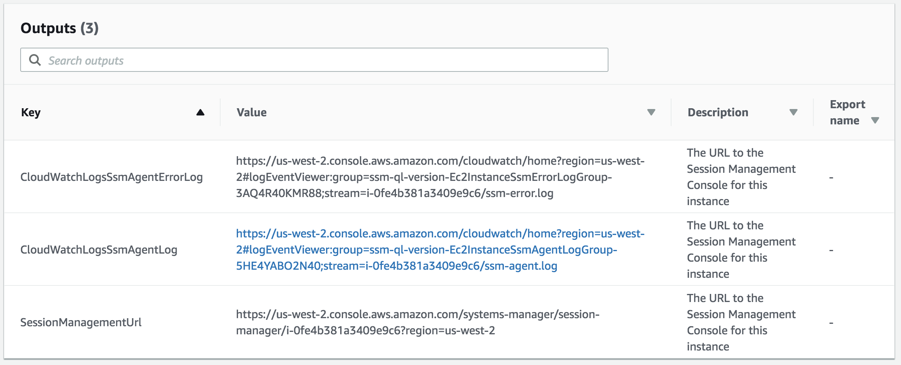
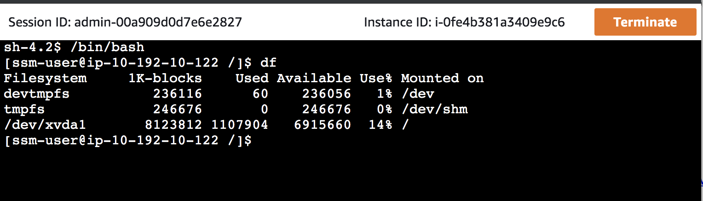
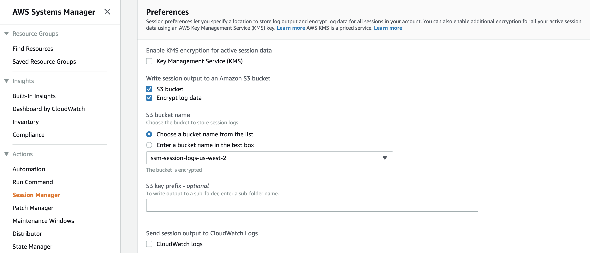

# aws-ssm-session-manager-example

Demonstrating the use of SSM Session Manager as alternative to enabling SSH access to 
EC2 instances

## Overview
Session Manager arrived as a tool in AWS Systems Manager (SSM) in Sept 2018.  It enables you to
open an interactive shell session to an EC2 host in the AWS Web Console.  This Jeff 
Barr [article](https://aws.amazon.com/blogs/aws/new-session-manager/) gives a nice introduction to the feature.

The `public-ec2-example.yaml` shows how you can enable connection to an EC2 instance in a public
subnet (Think; Bastion Host) via Session Manager rather than ssh.  This reduces the attack surface by shutting down the ssh port 
and removing the need to manage ssh keys for admins and developers.

To demonstrate it simply run the CloudFormation template `public-ec2-example.yaml`, then follow the `SessionManagementUrl` 
listed in the template outputs.

As easy as that you will be logged into the EC2 instance as the admin user; `ssm-user`

If we think about it though, a tool such as SSM Session manager removes the need for Bastions Hosts all together.
We can directly connect to EC2 hosts in private subnets via SSM Session Manager, removing the need to *poke holes* in the DMZ
in order to gain access.

Enabling this connection to *private* EC2 hosts involves creating VPC Endpoints for SSM to utilize. The `private-ec2-example.yaml`
template builds this scenario.

## Benefits

### Reduced Attack Surface

You can run with no publicly exposed ports and possibly even no bastion hosts in public subnets.

### Reduce permissions for ssm-user

You can choose to reduce the permissions for the `ssm-user`, leaving the elevated `ec2-user` for Sysadmin use.

### Session Logs are persisted

You can alert on and audit these logs for suspicious behavior. 

## Preconditions For SSM Session Management
There are a few preconditions required in order for SSM Session Manager to be able to connect to an EC2 instance.
The provided CloudFormation templates accommodate these preconditions, They are listed here for informational purposes.

### 1. SSM Agent is running in EC2 instance 
The SSM Agent in pre-installed on some of the core AWS AMIs including the latest Amazon Linux[1] and 2, but you can 
install it manually in other AMIs (and even on-prem). 
In our CloudFormation templates here we use Amazon Linux[1] and 2, so this box is checked for us, no action required.
If you are using older Amazon Linux[1] an AMIs that does not have the SSM agent pre-installed, see the 
[docs](https://docs.aws.amazon.com/systems-manager/latest/userguide/ssm-agent.html) for help with getting it installed.

### 2. EC2 Instance Profile Allowing SSM Management
By default, AWS Systems Manager does not have permission to perform actions on your EC2 instances.
There is an AWS-managed policy ([AmazonEC2RoleForSSM](https://docs.aws.amazon.com/systems-manager/latest/userguide/sysman-configuring-access-role.html)) 
that can be attached which gives SSM the required permissions to manage the instance.
This policy is a good starting point, examine it's permissions and determine if you want to go to production with it, if not 
you can provide your own scoped down policy.  Minimally you may want to limit S3 access to just what is needed by the instance and 
[SSM](https://docs.aws.amazon.com/systems-manager/latest/userguide/ssm-agent-minimum-s3-permissions.html).

### Persist Session Output [optional]

In the SSM Session Manager [preferences](https://docs.aws.amazon.com/systems-manager/latest/userguide/session-manager-logging-auditing.html) 
you can select to have session data including STDOUT recorded in an S3 bucket and/or CloudWatch Logs.  This gives 
you a great mechanism for alerting on session activity or as an aid to forensics.

